# Screenshots

Screenshots of the **nm-webui** interface, taken against mocked "travel router"
data (see [`docs/screenshots/`](screenshots/) for the raw files).

- **Theme** — the images below switch automatically: open this file in GitHub
  (or any viewer that honors `prefers-color-scheme`) and toggle your system
  dark/light mode. Light and dark images are separate files
  (`*.png` / `*-dark.png`).
- **Viewport** — every section is shown on **desktop** first; the **mobile**
  variant (narrow phone layout, mobile-first UI) is tucked under a
  `📱 Mobile` expander.

| Section | State | Desktop | Mobile |
|---|---|---|---|
| [Dashboard](#dashboard) | overview | [`dashboard.png`](screenshots/dashboard.png) | [`dashboard-mobile.png`](screenshots/dashboard-mobile.png) |
| [Wi-Fi](#wi-fi) | scanned networks | [`wifi.png`](screenshots/wifi.png) | [`wifi-mobile.png`](screenshots/wifi-mobile.png) |
| [Wi-Fi — Join dialog](#wi-fi--join-dialog) | password modal | [`wifi-join.png`](screenshots/wifi-join.png) | [`wifi-join-mobile.png`](screenshots/wifi-join-mobile.png) |
| [Portal](#portal) | mini-browser | [`portal.png`](screenshots/portal.png) | [`portal-mobile.png`](screenshots/portal-mobile.png) |
| [Portal — Open in new tab](#portal--open-in-new-tab-dialog) | confirm dialog | [`portal-open-tab.png`](screenshots/portal-open-tab.png) | [`portal-open-tab-mobile.png`](screenshots/portal-open-tab-mobile.png) |
| [Devices](#devices) | interface cards | [`devices.png`](screenshots/devices.png) | [`devices-mobile.png`](screenshots/devices-mobile.png) |
| [Profiles](#profiles) | saved profiles | [`profiles.png`](screenshots/profiles.png) | [`profiles-mobile.png`](screenshots/profiles-mobile.png) |
| [Profiles — New profile](#profiles--new-profile-dialog) | create dialog | [`profile-new.png`](screenshots/profile-new.png) | [`profile-new-mobile.png`](screenshots/profile-new-mobile.png) |
| [Power](#power) | password page | [`power.png`](screenshots/power.png) | [`power-mobile.png`](screenshots/power-mobile.png) |
| [Power — Confirmation](#power--confirmation-dialog) | confirm dialog | [`power-confirm.png`](screenshots/power-confirm.png) | [`power-confirm-mobile.png`](screenshots/power-confirm-mobile.png) |
| [Mobile navigation](#mobile-navigation) | nav menu | — | [`nav-open-mobile.png`](screenshots/nav-open-mobile.png) |

---

## Dashboard

Overview: connectivity badge, external IP with geo details, live device cards
(Ethernet / Wi-Fi / Mobile Broadband) and system info.

<picture>
  <source media="(prefers-color-scheme: dark)" srcset="screenshots/dashboard-dark.png">
  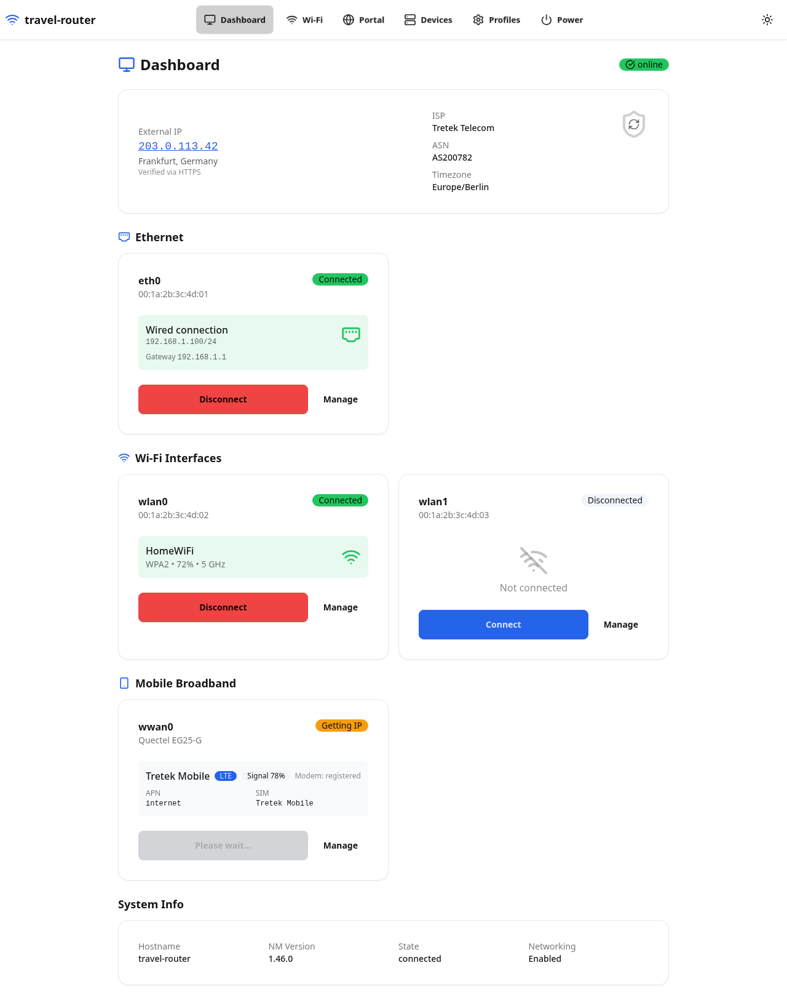
</picture>

  
📱 Mobile

  <picture>
    <source media="(prefers-color-scheme: dark)" srcset="screenshots/dashboard-dark-mobile.png">
    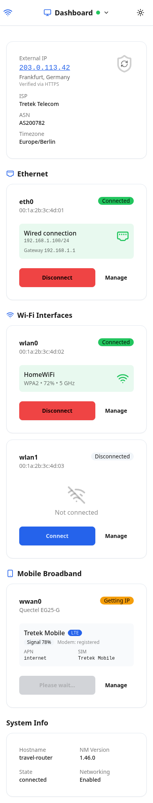
  </picture>

## Wi-Fi

Scanned networks on the selected interface: signal, band, security, "Saved"
and multi-AP badges, plus the interface selector, the selected interface's
status card and a Scan button.

<picture>
  <source media="(prefers-color-scheme: dark)" srcset="screenshots/wifi-dark.png">
  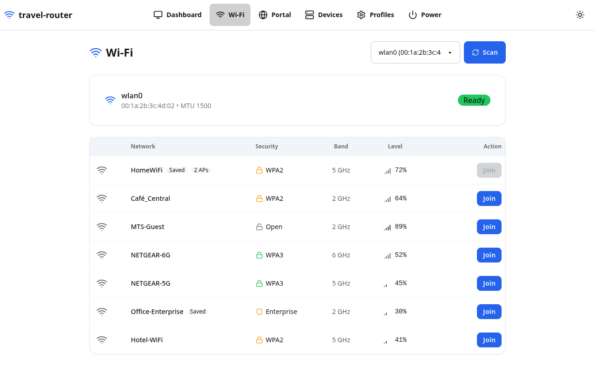
</picture>

  
📱 Mobile

  <picture>
    <source media="(prefers-color-scheme: dark)" srcset="screenshots/wifi-dark-mobile.png">
    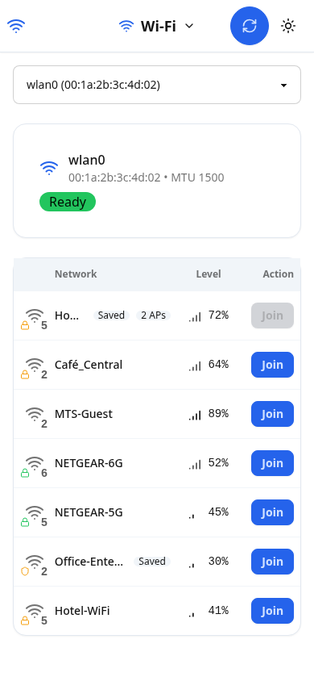
  </picture>

## Wi-Fi — Join dialog

Password prompt that opens when joining a secured network.

<picture>
  <source media="(prefers-color-scheme: dark)" srcset="screenshots/wifi-join-dark.png">
  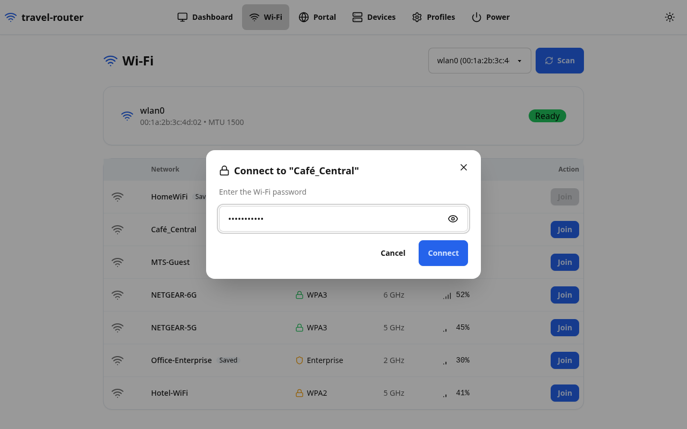
</picture>

  
📱 Mobile

  <picture>
    <source media="(prefers-color-scheme: dark)" srcset="screenshots/wifi-join-dark-mobile.png">
    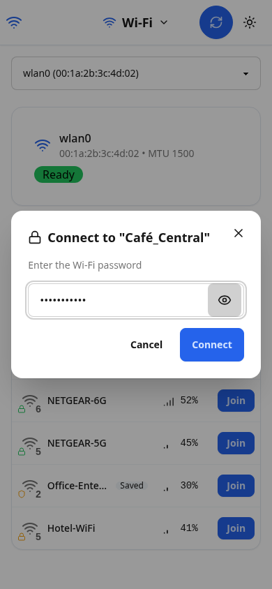
  </picture>

## Portal

Mini-browser for captive-portal sign-in. The address bar (with a Go button)
and the toolbar — here with the "Open in new tab" action — plus the sandboxed
`<iframe>` (served through the Go proxy) are shown; here it renders a sample
hotel sign-in page.

<picture>
  <source media="(prefers-color-scheme: dark)" srcset="screenshots/portal-dark.png">
  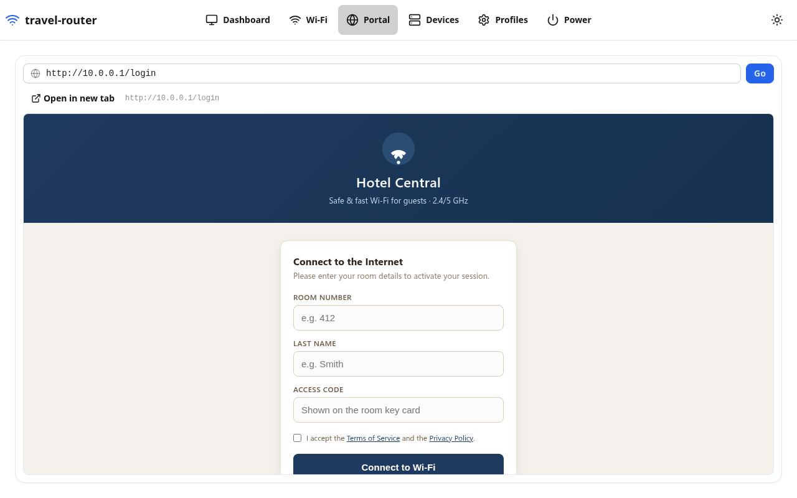
</picture>

  
📱 Mobile

  <picture>
    <source media="(prefers-color-scheme: dark)" srcset="screenshots/portal-dark-mobile.png">
    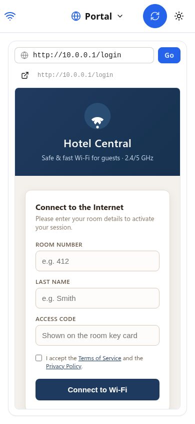
  </picture>

## Portal — Open in new tab dialog

Opening the portal page in a separate tab runs it **outside** the iframe
sandbox, so the mini-browser asks for an explicit acknowledgement first: the
risk is described and the Open button stays disabled until the confirmation
checkbox is ticked.

<picture>
  <source media="(prefers-color-scheme: dark)" srcset="screenshots/portal-open-tab-dark.png">
  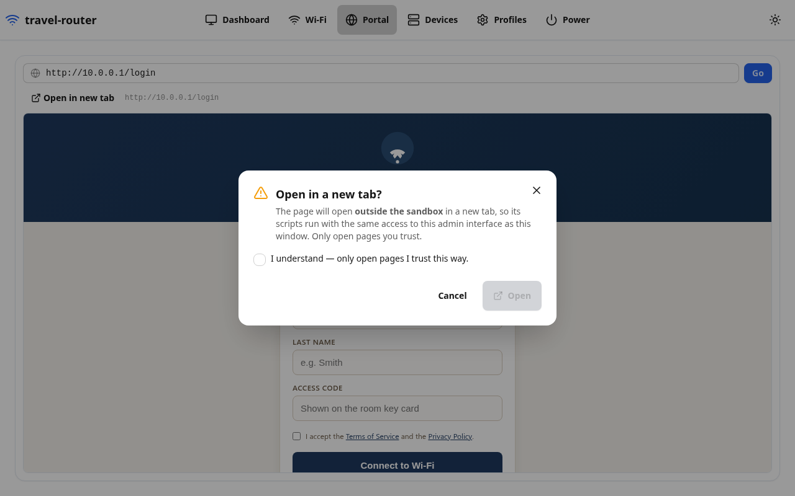
</picture>

  
📱 Mobile

  <picture>
    <source media="(prefers-color-scheme: dark)" srcset="screenshots/portal-open-tab-dark-mobile.png">
    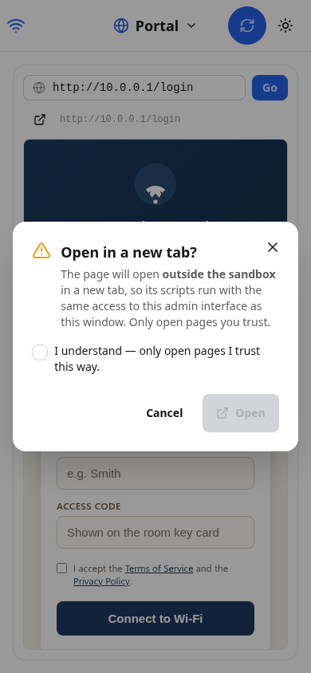
  </picture>

## Devices

Full network interface inventory: Ethernet, Wi-Fi and Mobile Broadband cards
with IP/DNS details, modem info (operator, signal, APN, SIM, IMEI) and
connect/disconnect actions.

<picture>
  <source media="(prefers-color-scheme: dark)" srcset="screenshots/devices-dark.png">
  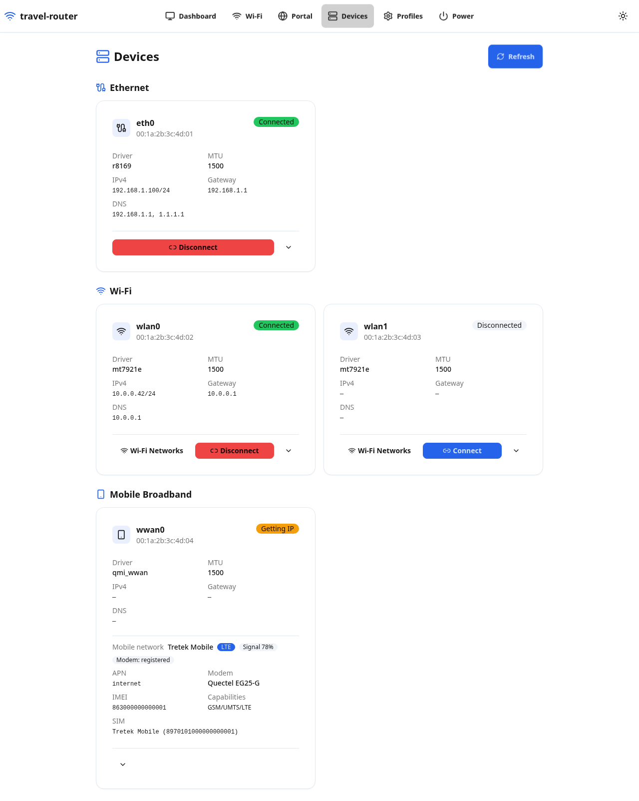
</picture>

  
📱 Mobile

  <picture>
    <source media="(prefers-color-scheme: dark)" srcset="screenshots/devices-dark-mobile.png">
    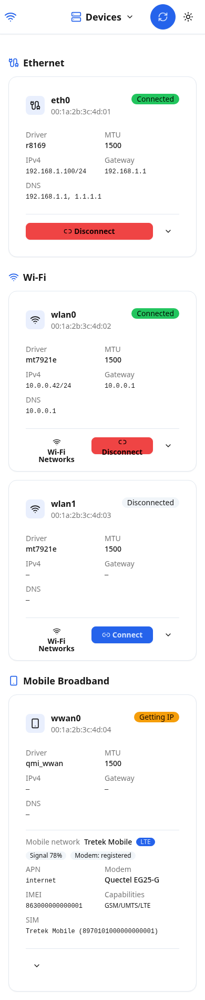
  </picture>

## Profiles

Saved NetworkManager profiles grouped by type (Wi-Fi, Ethernet, Mobile
Broadband, Other): active/APN badges, auto-connect switch, expandable details.

<picture>
  <source media="(prefers-color-scheme: dark)" srcset="screenshots/profiles-dark.png">
  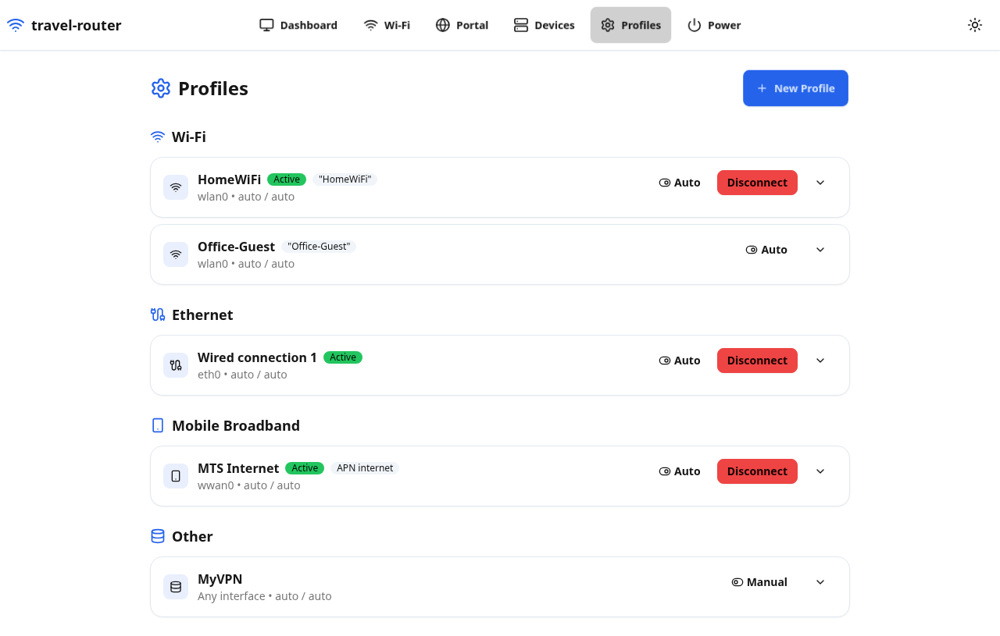
</picture>

  
📱 Mobile

  <picture>
    <source media="(prefers-color-scheme: dark)" srcset="screenshots/profiles-dark-mobile.png">
    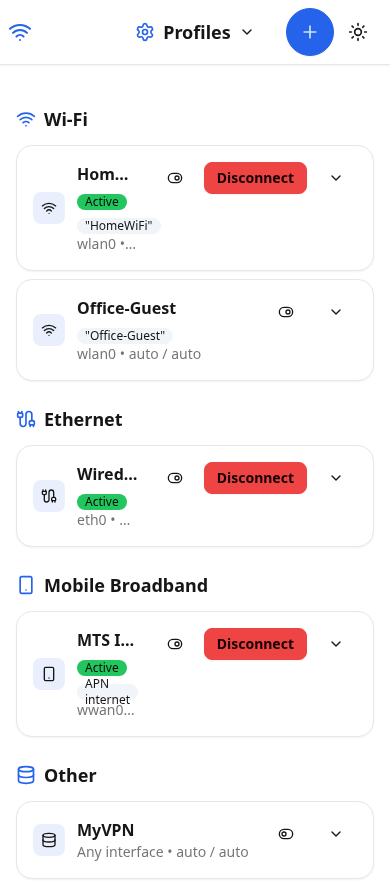
  </picture>

## Profiles — New profile dialog

Create/edit dialog for a connection profile (Wi-Fi, Ethernet, Bridge, GSM).

<picture>
  <source media="(prefers-color-scheme: dark)" srcset="screenshots/profile-new-dark.png">
  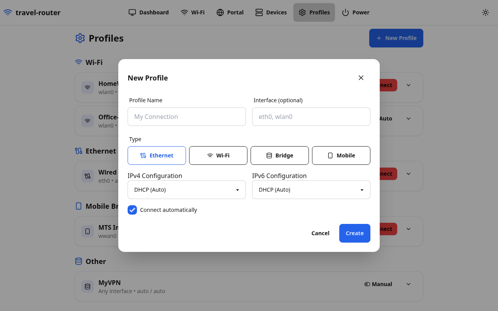
</picture>

  
📱 Mobile

  <picture>
    <source media="(prefers-color-scheme: dark)" srcset="screenshots/profile-new-dark-mobile.png">
    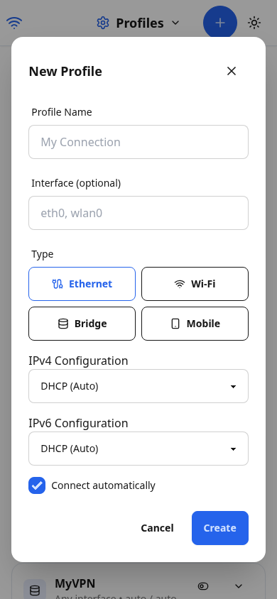
  </picture>

## Power

Reboot / power off page. Only appears when a `power-action-password` is
configured; both actions require the password.

<picture>
  <source media="(prefers-color-scheme: dark)" srcset="screenshots/power-dark.png">
  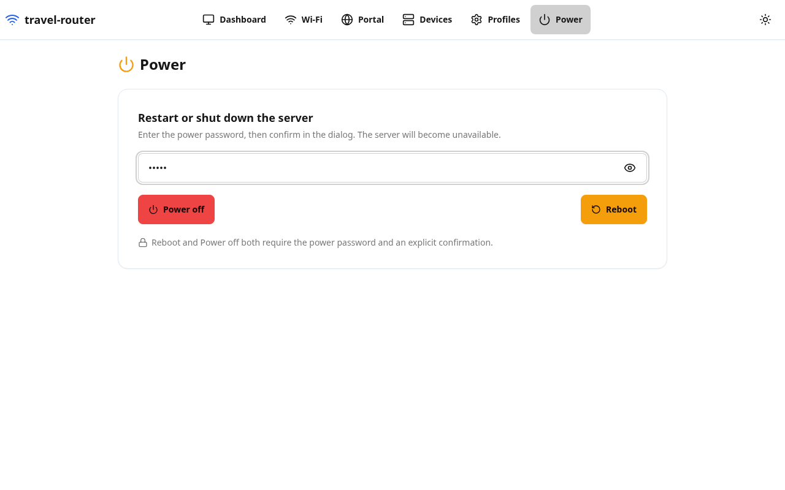
</picture>

  
📱 Mobile

  <picture>
    <source media="(prefers-color-scheme: dark)" srcset="screenshots/power-dark-mobile.png">
    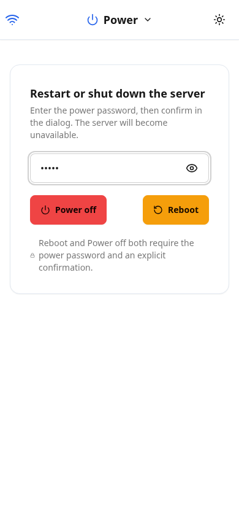
  </picture>

## Power — Confirmation dialog

Before anything is executed the user must tick the confirmation checkbox.

<picture>
  <source media="(prefers-color-scheme: dark)" srcset="screenshots/power-confirm-dark.png">
  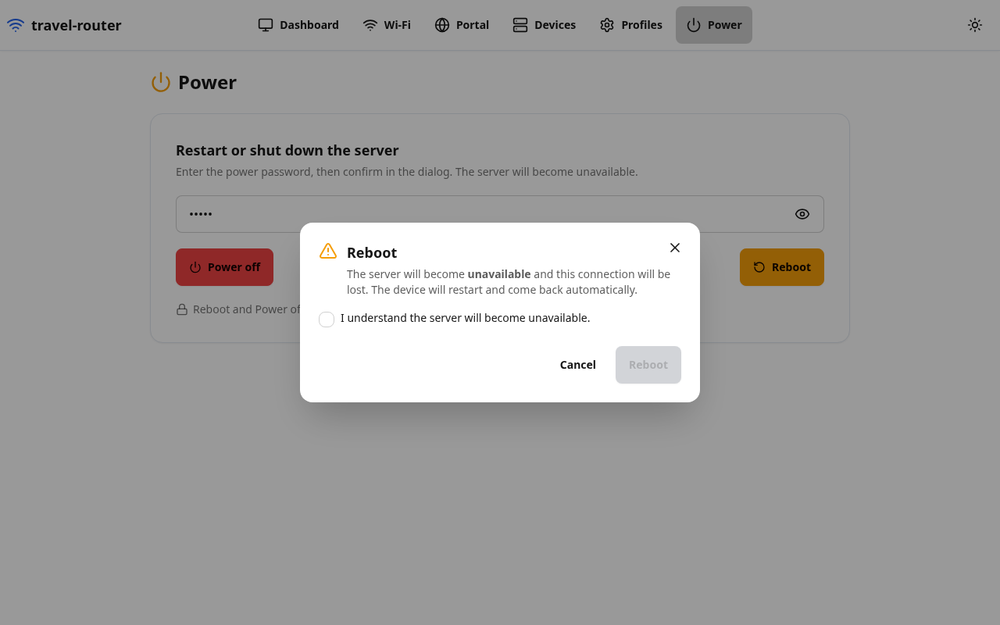
</picture>

  
📱 Mobile

  <picture>
    <source media="(prefers-color-scheme: dark)" srcset="screenshots/power-confirm-dark-mobile.png">
    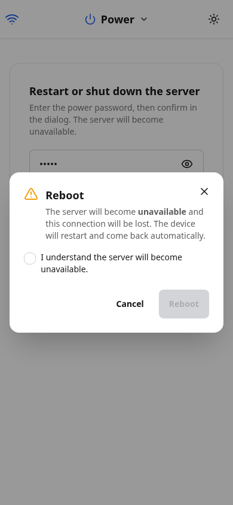
  </picture>

## Mobile navigation

The navigation menu as opened on a phone-width viewport.

<picture>
  <source media="(prefers-color-scheme: dark)" srcset="screenshots/nav-open-dark-mobile.png">
  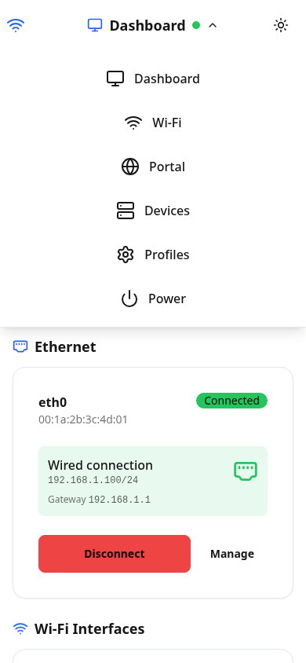
</picture>

---

## How these were made

- Frontend: `cd webui && npm run build` (screenshots show the real SPA).
- Backend: a local mock server answering the `/api/v1/*` endpoints with the
  "travel router" dataset above (no NetworkManager involved).
- Capture: headless Chromium via Playwright, `1280×800` desktop and `390×844`
  phone viewports, full-page captures for pages.